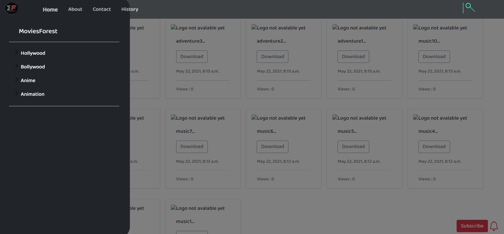

# MOVIES_FOREST 3.0
This project has old versions [movies forest 2.0](https://github.com/hitesh911/moviesforest-2.0) , [movies forest](https://github.com/hitesh911/movies_forest)

# CinemaHaven (Formerly MoviesForest)

CinemaHaven is an ambitious web application that I developed using Django, a powerful Python web framework, along with the Jinja2 template engine. Originally named MoviesForest, this project aimed to provide users with a comprehensive platform for streaming movies and series. Please note that this project is no longer maintained or live due to ethical, moral, and legal considerations.

## Key Features

### Robust Django Framework
CinemaHaven leverages the Django framework to ensure robustness, scalability, and maintainability. With Django's built-in features like ORM, authentication, and admin panel, the development process was streamlined, allowing for efficient implementation of various functionalities.

### Responsive Design with Bootstrap
I utilized Bootstrap to create a visually appealing and fully responsive user interface. The responsive design ensures that the platform is accessible and user-friendly across a wide range of devices, including desktops, tablets, and mobile phones.

### Content Archiving and Management
As MoviesForest, this project served as an archive for a vast collection of movies and series. Users could browse, search, and stream content seamlessly, thanks to Django's powerful data management capabilities.

### Iterative Development and Versioning
The project repository includes multiple versions of CinemaHaven, showcasing iterative improvements and feature enhancements over time. Each version represents a milestone in the project's development, demonstrating my ability to iterate and refine a complex web application.

## Setup Instructions

To set up CinemaHaven on your local machine, follow these instructions:

1. **Clone the Repository**: 
   ```
   git clone https://github.com/hitesh911/moviesforest-3.0/edit/main
   ```

2. **Install Dependencies**:
   ```
   cd CinemaHaven
   pip install -r requirements.txt
   ```

3. **Database Setup**:
   ```
   python manage.py migrate
   ```

4. **Create Superuser** (Optional):
   ```
   python manage.py createsuperuser
   ```

5. **Run the Development Server**:
   ```
   python manage.py runserver
   ```

6. **Access the Application**:
   Open your web browser and navigate to `http://localhost:8000` to access CinemaHaven.

## Screenshots

Below are screenshots showcasing different versions of the CinemaHaven project:





## Note

While CinemaHaven is no longer maintained or live, it stands as a testament to my skills in web development, particularly in Django, frontend design using Bootstrap, and project management. It's important to acknowledge that the distribution of pirated content is illegal and unethical, and I do not condone or support such activities.
